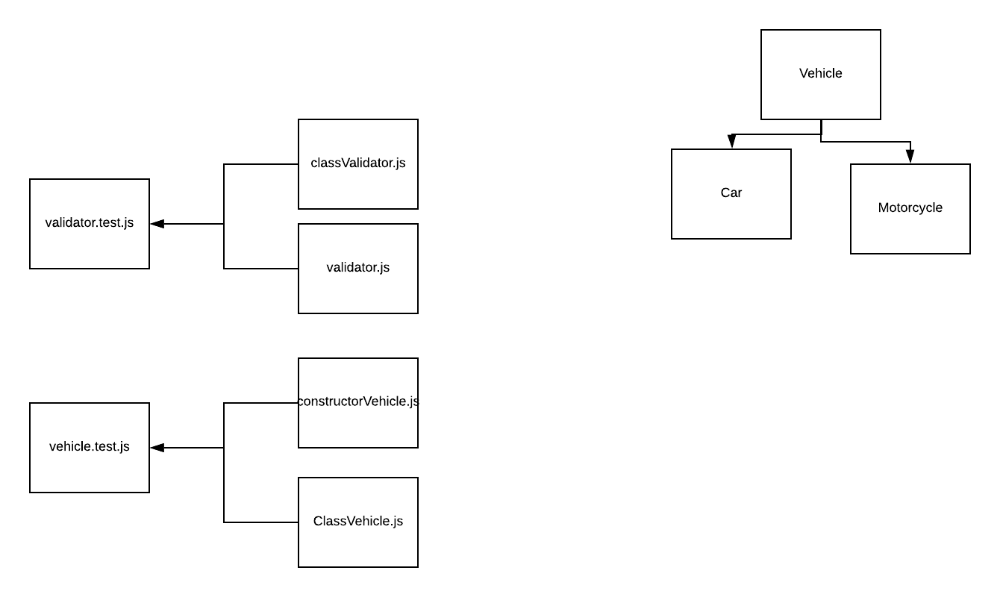

# LAB - 02

## Tests, classes, modules and constructor based objects

### Author: David Vloedman

### Links and Resources
* [submission PR](https://github.com/david-vloedman-401-advanced-javascript/401-lab-02/pull/1)
* [travis](https://travis-ci.com/david-vloedman-401-advanced-javascript/401-lab-02)

#### Documentation

[Classes](./classes/out/index.html)
[Validator](./classes/out/index.html)

### Setup

npm run
  
#### Tests

npm test

#### UML

